# Pokémon Celadon Version

This hack is designed as an upgrade to the original Pokémon Red, Blue, and Green, aiming to enhance the classic experience without overcomplicating its core identity. It features a personal pick of improved graphics, expanded events, and a variety of restored content.
Started this project a long time ago and some ideas changed, but I'm commited to finish it now: https://web.archive.org/web/20180903101807/https://hax.iimarckus.org/topic/7257/

This hack is intended to be played in Super Gameboy mode to appreciate a variety of new graphics and palettes.

Why Celadon Version?:
Celadon City has always been my favorite location in the first generation, from the music to the visuals and the variety of events. This is a very personal hack.

To patch the ROM, Beat Patcher is recommended. https://www.romhacking.net/utilities/893/

## Features

### Core Mechanics, Enhanced Gameplay & QoL

- Gender Selection.
- Skateboard: A new way to travel! Match the Bike's speed and jump over ledges in reverse. (Find the Secret Long House on Route 25 to obtain it).
- Running Shoes: Press B to move faster while walking, cycling, skating, or swimming.
- Field Moves: Use SURF, CUT, and STRENGTH by interacting directly with the overworld. No menus required.
- Swap Pokémon positions instantly by pressing SELECT in the party menu.
- Added a USE/QUIT prompt before throwing Pokéballs to avoid accidental throws.
- An NPC in Rock Tunnel uses FLASH for you without needing the HM.
- New trainer classes: Female Rocket, Rookie and Yujirou (From Prototypes).

### Upgraded Graphics

- New sprites, new palettes, Gen 2-style party icons, custom Super Gameboy border.
- Unique surfing sprites for Lapras and Pikachu.

### Optional Sidequests

- Battle Yujirou early at 2nd floor of Route 22 Gate for a strategic TM19 gift!
- You can have all 3 starters like in Pokémon Yellow.
- Obtain a Rocket Suit after Nugget Bridge. Use it to skip Team Rocket battles or even steal enemy Pokémon (ends the battle instantly).
- Celadon University: A new location, graduate to earn a Diploma and a unique Magikarp with Dragon Rage.
- Reunite Erik and Sara in the Safari Zone to earn a Free Pass.
- Mew under the truck.

## Post-Game

### Your New Home

- Move out of Pallet Town! Visit the Celadon Hotel to set your new residence in any city (including the Summer Beach House on Route 19).
- Decoration: Interact with the Gameboy in your room to arrange your Pokémon Dolls.
- Visits: Your new home feels alive! Daisy might drop by for tea to heal your team, or Bill might visit to grant you access to his secret Garden.
- Pidgey Rewards: Keep an eye out for a friendly Pidgey that occasionally leaves gifts.

### New quests

- S.S. Anne: The cruise ship returns with a deck full of new trainers.
- Complete your PokéDex in brand-new zones: Bill’s Garden, Mystery Cave, and extended Routes 0, 1, and 21.
- Find a NPC in the Mystery Cave who gives you the Fossil you missed in Mt. Moon.
- Rematch the Gym Leaders as much as you want (Yujirou replaces Giovanni).
- Catch all 151 to unlock the battle Professor Oak at the League.

### Additional Improvements

- There's a new room with a healing bed in SS Anne.
- Trainers in Gyms now have dialogue after you earn a badge or reach the post-game.
- If you have badge(s) Guards have shorter texts on Route 23.
- Nurse at Silph Co. 9F still heals you after beating Team Rocket.
- Restored PC on Celadon Hotel.

## Version Exclusives & Completion

Celadon Version is split into Red and Blue editions. While each maintains its original exclusive encounters, all 151 Pokémon are obtainable in the post-game by exploring the Mystery Cave.

# Screenshots

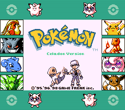
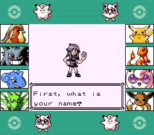
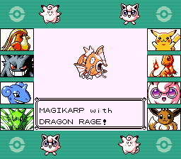
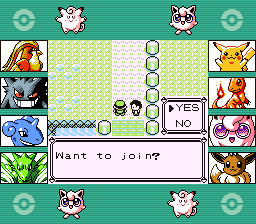

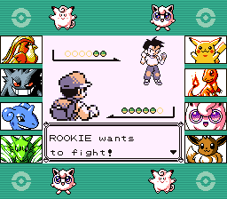

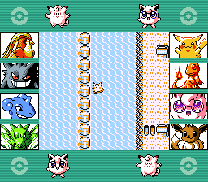

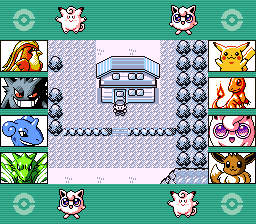
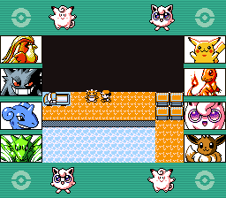
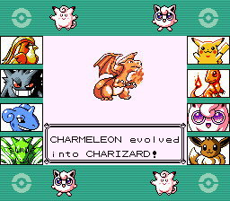
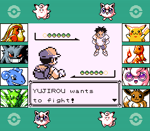
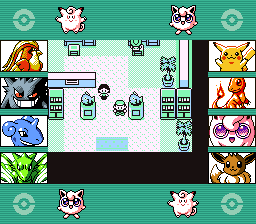

# Credits

**Narishma-gb, Sylvie, Pan Docs files, superfamiconv** (HELPED A LOT with 4bpp adaptation used to built it.)
- SGB Border.

**Sylvie**
- Talk to use SURF, CUT, STRENGTH.
- Ported Charmander, Squirtle, Bulbasaur givers.
- Polished Map.

**Pigu-A**
- Battle with Professor Oak.

**Pigu-A, luckytyphlosion, and Vortyne**
- Mew under the truck.

**Vortyne**
- Lapras can Surf in Fuchsia City.
- New trainer class Rookie.
- Press SELECT to switch Pokémon in your party menu.
- Optimization on Home bank.
- Move badge "item" definitions outside actual item list.
- Original idea of Erik and Sara Reunion.
- Original idea of drinking tea with Daisy.

**Mr. Cheeze**
- Music: VS Mew.

**cRz-Shadows**
- New party icons code.

**Sanqui and Dannye**
- For pokered-crysaudio used for this project

**Dannye**
- Surf with Lapras, Seel, Pikachu.
- Crystal Tracker was used to make the new Skateboard theme.

**PokefanMarcel**
- Now on Champion's House you can have random visits. (this code is based on MtMoonSquare_Script on his hack yumepokered)

**Jojobear**
- Run animation.

**ShiraTheMogul**
- Fixing STRENGTH overworld bug.

**Tobias_Levi**
- Female trainer front sprite and backsprite.

**LuigiTKO**
- Articuno, Zapdos, Moltres, Mew, Mewtwo overworld sprites.

**Chibi-Pika**
- Lugia sprite.

**icycatelf**
- Togepi sprite.

**pret tutorials**
- Add a new map sprite
- Adding gym leader rematches
- Adding Gender Selection (original tutorial done by **Luna**)
- Add debug mode to Red version
- Restore the invisible PC in the Celadon Hotel
- Free some space in the Home BANK
- Free MORE some space in the Home BANK
- Add caught icon to battle HUD for already‐owned Pokémon

# Pokémon Red and Blue [![Build Status][ci-badge]][ci]

This is a disassembly of Pokémon Red and Blue.

It builds the following ROMs:

- Pokemon Red (UE) [S][!].gb `sha1: ea9bcae617fdf159b045185467ae58b2e4a48b9a`
- Pokemon Blue (UE) [S][!].gb `sha1: d7037c83e1ae5b39bde3c30787637ba1d4c48ce2`
- BLUEMONS.GB (debug build) `sha1: 5b1456177671b79b263c614ea0e7cc9ac542e9c4`
- dmgapae0.e69.patch `sha1: 0fb5f743696adfe1dbb2e062111f08f9bc5a293a`
- dmgapee0.e68.patch `sha1: ed4be94dc29c64271942c87f2157bca9ca1019c7`

To set up the repository, see [**INSTALL.md**](INSTALL.md).

## See also

- [**Wiki**][wiki] (includes [tutorials][tutorials])
- [**Symbols**][symbols]
- [**Tools**][tools]

You can find us on [Discord (pret, #pokered)](https://discord.gg/d5dubZ3).

For other pret projects, see [pret.github.io](https://pret.github.io/).

[wiki]: https://github.com/pret/pokered/wiki
[tutorials]: https://github.com/pret/pokered/wiki/Tutorials
[symbols]: https://github.com/pret/pokered/tree/symbols
[tools]: https://github.com/pret/gb-asm-tools
[ci]: https://github.com/pret/pokered/actions
[ci-badge]: https://github.com/pret/pokered/actions/workflows/main.yml/badge.svg
